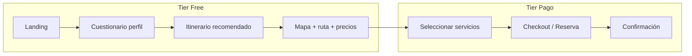

# Plan MVP DreamedTrip

## Objetivo

Conectar con viajeros mediante: (1) identificar tipo de viajero con preguntas clave **antes** de mostrar opciones o mapa; (2) recomendar itinerario con ruta trazada en mapa interactivo, precios y datos útiles; (3) permitir reservar todo el itinerario (tier pago). Free = buscar y ver ruta ideal; Paid = reservar con vos (transporte, comida, guías, actividades, costos y tiempos claros).

---

## Arquitectura de flujo

- **Rutas sugeridas**: `/` (landing) → `/plan` (cuestionario) → `/itinerary` (resultado + mapa) → `/book` (reserva).
- **Auth**: necesario para guardar perfil, itinerarios y reservas; asumir API de auth (login/signup/session) ya existente o a implementar en backend.

---

## 1. Cuestionario de perfil de viajero (antes del mapa)

**Objetivo**: Capturar tipo de viajero antes de mostrar cualquier destino o mapa. Una sola fuente de verdad para recomendaciones.

**Preguntas clave sugeridas** (definir con producto; ejemplos):

- Destino o tipo de destino (ciudad, naturaleza, playa, mixto).
- Duración del viaje (días).
- Presupuesto (rango o nivel: económico / medio / premium).
- Quién viaja (solo, pareja, familia, amigos).
- Ritmo (tranquilo, equilibrado, intenso).
- Intereses (gastronomía, cultura, aventura, relax, fotografía, etc. — multi-select).
- Preferencias de alojamiento y transporte (opcional en MVP).

**Implementación**:

- **Ruta**: `app/plan/page.tsx` (o `/plan-trip`). Acceso desde landing con CTA “Planear mi viaje”.
- **Flujo multi-paso**: 4–6 pasos, una o dos preguntas por paso. Barra o steps de progreso (shadcn `Progress` o steps custom).
- **Formulario**: `react-hook-form` + `zod`. Schema único `TravelerProfile` (destino, días, presupuesto, compañía, ritmo, intereses[]).
- **Persistencia**: Enviar al API al completar (ej. `POST /api/profile` o `PUT /api/users/me/travel-profile`). Si no hay auth, guardar en `localStorage` y enviar al API cuando el usuario se registre.
- **UX**: 
  - Una pregunta por pantalla en móvil; en desktop se pueden agrupar 2 por paso.
  - Transiciones suaves entre pasos (CSS o `tw-animate`).
  - Botones “Siguiente” / “Anterior” y “Ver mi itinerario” al final.
  - Empty state solo si abandonan a mitad (opcional: “Continuar donde lo dejaste”).

**Datos**: Tipos en `lib/types/traveler.ts` (o `types/`). Contrato del API en `lib/api/profile.ts` (fetch a `/api/...`).

---

## 2. Itinerario recomendado + mapa interactivo (Mapbox)

**Objetivo**: Tras el cuestionario, mostrar un itinerario con ruta en mapa, lugares, precios y datos relevantes. Todo esto en tier Free (sin reserva).

**API**:

- Asumir endpoint que recibe perfil y devuelve itinerario: ej. `POST /api/itinerary` body `TravelerProfile`, response `Itinerary` (días, lugares, ruta ordenada, precios estimados, actividades).
- Si el backend no existe aún: mock en `lib/api/itinerary.ts` que devuelve un `Itinerary` de ejemplo según `TravelerProfile`.

**Estructura de datos** (ejemplo en `lib/types/itinerary.ts`):

- `Itinerary`: `days[]`, `summary` (coste total estimado, duración).
- `Day`: `date`, `stops[]`, `transportBetweenStops[]`.
- `Stop`: `placeId`, `name`, `lat`, `lng`, `type` (hotel, restaurante, actividad, etc.), `price`, `duration`, `description`.

**Ruta**: `app/itinerary/page.tsx`.

- Recibe por estado o por query (ej. `?from=plan`) el perfil recién enviado; si no hay, obtener último itinerario del usuario desde API (ej. `GET /api/itinerary/latest`) o redirigir a `/plan`.

**Mapa (Mapbox)**:

- Instalar `mapbox-gl` y `@types/mapbox-gl`. Token en env `NEXT_PUBLIC_MAPBOX_TOKEN`.
- Componente cliente: `components/map/ItineraryMap.tsx` (o en `components/itinerary/`).
- Cargar mapa centrado en el primer punto o en bbox del itinerario.
- Dibujar polyline que una los `stops` en orden (coordinates desde `stops[].lat/lng`).
- Marcadores por parada: popup o panel lateral con nombre, tipo, precio, duración. Usar shadcn `Card` / `HoverCard` para los detalles.
- Responsive: mapa a ancho completo; en móvil, lista de paradas colapsable o bottom sheet (shadcn `Sheet`) para no tapar el mapa.

**Panel lateral (desktop) o lista (móvil)**:

- Resumen por día: lugares, horarios sugeridos, precios. Enlaces a “Reservar” que lleven a `/book?day=1&stop=...` o similar.
- Mostrar total estimado y mensaje claro: “Para reservar transporte, alojamiento y actividades con nosotros, pasá al tier pago”.

**UX**:

- Carga: skeleton del mapa y de la lista (shadcn `Skeleton`).
- Si no hay itinerario (error API): empty state con “Volver a planificar” → `/plan`.

---

## 3. Reserva (tier pago)

**Objetivo**: Reservar de forma rápida y confiable: transporte, comida, hoteles, guías, actividades. El usuario ya vio su ruta y precios; acá confirma y paga.

**API**:

- `POST /api/bookings` (o por día/servicio) con itinerario + selección de servicios. Response: confirmación y posible link de pago externo.
- Si el backend no está listo: flujo completo en UI y `POST` que devuelva confirmación mock; después se conecta pasarela real.

**Ruta**: `app/book/page.tsx`.

- Entrada: desde itinerario (ej. “Reservar todo” o “Reservar este día”). Query/state con `itineraryId` o itinerario en memoria.
- Pasos típicos: (1) Revisar resumen y selección de servicios por día; (2) Datos del viajero (si no está logueado, pedir login/registro); (3) Pago o “Solicitar reserva” (según negocio); (4) Página de confirmación.

**Componentes**:

- Resumen de reserva: lista de ítems (transporte, alojamiento, actividades, guías) con precio. shadcn `Table` o `Card`.
- Formulario de datos y términos: `react-hook-form` + `zod`.
- CTA claro: “Reservar con DreamedTrip” y aviso de qué incluye (transporte, alojamiento, etc.) para generar confianza.

**UX**:

- Indicador de pasos (stepper) y posibilidad de volver atrás.
- Toasts (shadcn `sonner`) para éxito/error de envío.

---

## 4. Landing y navegación

- **Landing** (`app/page.tsx`): Hero con propuesta de valor, CTA principal “Planear mi viaje” → `/plan`. Secundario “Ver ejemplo” (opcional: itinerario demo). Diseño alineado con [frontend-design SKILL](.cursor/skills/frontend-design/SKILL.md): tipografía y paleta distintivas, no genéricas.
- **Layout**: Header con links a “Planear viaje”, “Mi itinerario” (si hay uno), “Reservas” (si hay usuario). Auth: botón Login/Registro o menú usuario (shadcn `DropdownMenu`).
- **Metadata**: En `app/layout.tsx` y por página: title/description para DreamedTrip (SEO básico).

---

## 5. Estado y auth

- **Auth**: Asumir API con sesión (cookie o JWT). En Next.js: middleware para proteger `/book` y opcionalmente “Mi itinerario”. Provider de sesión (React Context o librería tipo NextAuth si la usan) para mostrar estado login/logout.
- **Perfil e itinerario**: Tras login, poder recuperar último perfil e itinerario desde API para “Continuar planificación” o “Ver mi reserva”.
- **Free vs Paid**: En UI, textos y botones que diferencien “Ver itinerario / Explorar” (free) de “Reservar con DreamedTrip” (paid). No bloquear vistas del mapa ni del itinerario; solo la acción de reserva requiere cuenta (y pago cuando corresponda).

---

## 6. Stack técnico concreto

| Necesidad   | Elección                                                                  |
| ----------- | ------------------------------------------------------------------------- |
| Mapas       | Mapbox GL JS (`mapbox-gl`), token en `NEXT_PUBLIC_MAPBOX_TOKEN`           |
| Formularios | `react-hook-form` + `zod` (ya en proyecto)                                |
| UI          | shadcn (Button, Card, Sheet, Progress, Skeleton, Dialog, Form, etc.)      |
| HTTP API    | `fetch` en server actions o en `lib/api/*`; tipos compartidos con backend |
| Estilos     | Tailwind + `globals.css` (variables ya definidas)                         |

---

## 7. Orden sugerido de implementación

1. **Tipos y API client**
  `lib/types/traveler.ts`, `lib/types/itinerary.ts`, `lib/api/profile.ts`, `lib/api/itinerary.ts`, `lib/api/bookings.ts` (y auth si aplica). Mock de itinerario en función del perfil si el backend no está listo.
2. **Cuestionario**
  `app/plan/page.tsx`, schema zod, pasos, progreso, envío a API (o localStorage) y redirección a `/itinerary`.
3. **Página itinerario**
  `app/itinerary/page.tsx`: fetch itinerario (por estado desde `/plan` o desde API), layout con mapa + lista por días.
4. **Mapa Mapbox**
  `components/map/ItineraryMap.tsx`: polyline de ruta, marcadores, popups/paneles con datos y precios. Integrar en `app/itinerary/page.tsx`.
5. **Flujo de reserva**
  `app/book/page.tsx`: resumen, formulario, envío a API y página de confirmación.
6. **Landing y navegación**
  Rediseño de `app/page.tsx`, header con navegación y auth, metadata.
7. **Ajustes UX**
  Loading states, empty states, mensajes Free vs Paid, responsive del mapa y del sheet en móvil.

---

## Archivos clave a crear o tocar

- `lib/types/traveler.ts`, `lib/types/itinerary.ts`
- `lib/api/profile.ts`, `lib/api/itinerary.ts`, `lib/api/bookings.ts`
- `app/plan/page.tsx` (cuestionario multi-paso)
- `app/itinerary/page.tsx` (vista itinerario + mapa)
- `components/map/ItineraryMap.tsx` (Mapbox + ruta + marcadores)
- `app/book/page.tsx` (reserva)
- `app/page.tsx` (landing) y layout/header para navegación y auth

Si el backend expone contratos (OpenAPI o documentación), alinear tipos en `lib/types` y las llamadas en `lib/api` con esos contratos desde el inicio.